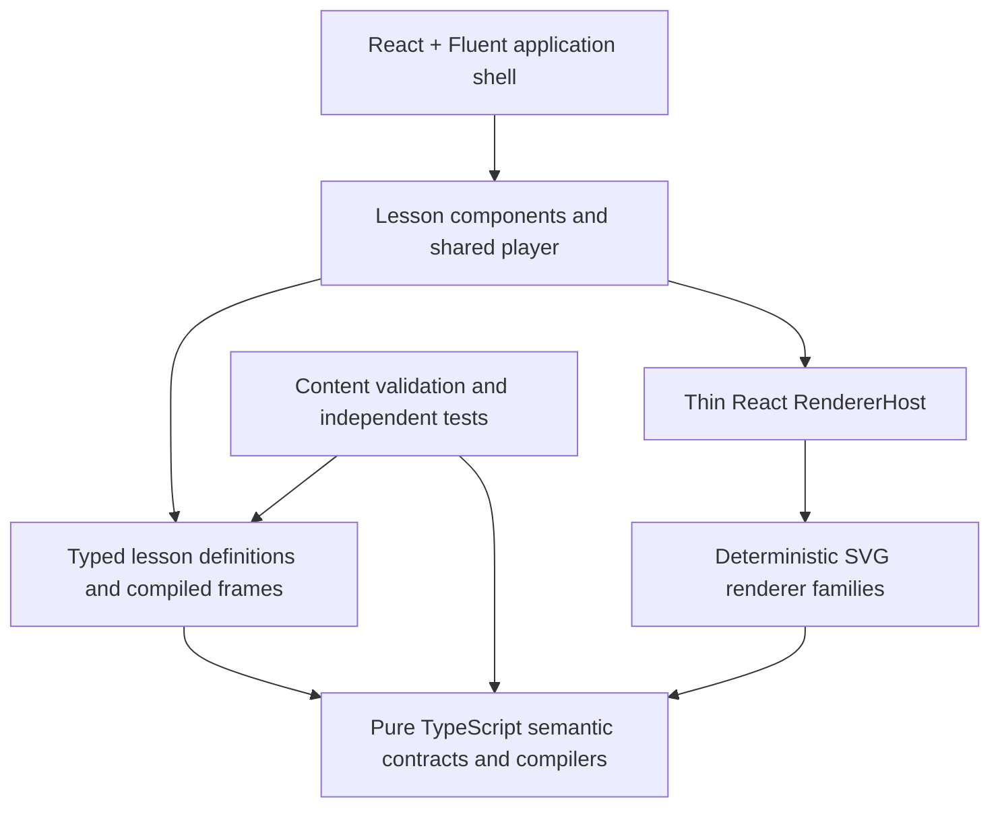

# Product vision and architecture

Status: lead decision, 2026-09-08. Current code is a working three-concept proof; the target below is incremental, not a claim that all these capabilities exist.

## The product we are building

Visual IT Concepts helps analysts, BI developers and data engineers answer a concrete question about data behavior. A learner opens a concept, inspects a small input, steps through a visible transformation, compares a meaningful variation, and leaves knowing the result, the reason, and a common mistake to avoid.

The unit of value is a **correct, inspectable explanation**. Every concept needs an explicit question, inputs, stable entities, readable state at every step, an accurate result, and a practical takeaway. Motion is optional. A pretty diagram with an incorrect total or an unexplained state is a failed feature.

The first useful release should cover a connected path from row identity and grain, through JOIN and GROUP BY, into windows and data movement, with pipeline reliability explaining how those transformations are operated. Existing bubble sort remains a compact algorithm example. A large unrelated algorithm catalog is not the next priority.

## Major capabilities and why

| Capability | Learner benefit | Planned order |
| --- | --- | --- |
| Join correspondence and duplicate-key multiplication | Recognize missing rows, expanded rows and double counting | Exists; preserve and harden |
| GROUP BY, SUM and COUNT | Understand a change from one row per order to one row per customer key | S04 |
| Concept discovery and stable links | Find and return to an explanation without replaying a catalog | Candidate S05 |
| WHERE versus HAVING | Distinguish filtering source rows from filtering resulting groups | After grouping and SQL predicate decision |
| Partitions, window ordering, ranking and explicit ROWS frames | Understand computations that preserve row grain and tie behavior | After grouping and typed lesson contracts |
| Fan-out/fan-in, retries and idempotency | See dependencies, independent branches and why rerunning can duplicate output | After success-dependency assertions |
| Shuffle, partition ownership and skew | Explain the physical work behind grouped/distributed data | After grouping and a bounded renderer audit |
| Fact/dimension grain and technical lineage | Connect query behavior to reliable BI measures and transformations | After joins/grouping; no BI authoring/export product |

Catalog sections are one product. No login, backend, database service, external compute, arbitrary SQL execution, public editor, notebook, LMS, architecture designer, or universal animation system is required for this roadmap. Provider-specific examples come only after generic behavior is correct and their claims have authoritative sources.

## Dependency direction

The semantic core must not import React, Fluent, DOM APIs, app state or content. SVG renderers can depend on core types, layout and DOM helpers; they cannot read application state or decide business results. React owns selection and lifecycle. Content owns teaching intent, examples and semantic steps. Validation checks those contracts before shipping.

## Target modules, introduced only when used

| Area | Responsibilities | Explicit boundary |
| --- | --- | --- |
| `src/App.tsx` | Fluent theme, header, navigation, selected concept ID, lesson composition | No join-specific arithmetic, frame-number meaning or renderer ternary chain |
| `src/figures/content/` | Pure lesson metadata, fixtures, semantic step IDs, captions derived from compiled values, authored scope limitations | No JSX, DOM, timers, viewport coordinates or SQL parser |
| `src/figures/core/` | Validated records, identity, deterministic compile functions, snapshots and transitions | No lesson names, React components or layout values in semantic state |
| `src/figures/react/` | Shared player, thin renderer lifecycle host and reusable accessible presentation | No reimplementation of joins or aggregation |
| `src/lessons/` (S04) | Typed React composition per lesson; adapter between pure frames and views | No unchecked generic renderer casts or new execution engine |
| `src/figures/renderers/` | Keyed SVG elements, computed layout, theme, static drawing and optional transitions | Input is authoritative; do not recompute different totals here |
| `scripts/validate-content.ts` | Enumerate every registered lesson and variant; reject invalid references and instructional invariants | Do not certify correctness solely by counting frames |

A small typed catalog is enough. Keep pure metadata in content and the React component map in `src/lessons/`. Use a discriminated union or checked component map. A type-safe switch within lesson composition is acceptable; a plugin framework, dependency injection container or catch-all `any` registry is not needed. Do not move the existing giant conditional unchanged into a new file and call that the architecture complete.

## Fixed semantic decisions

1. **Identity is separate from values.** Record IDs remain stable when keys repeat. Join output identity includes both contributors. Group identity derives from the grouping column and typed key value, not position or a display label. NULL and the string `"null"` differ; number `1` and string `"1"` differ. Normalize numeric negative zero if accepted. Reject non-finite numbers.
2. **Semantic steps have meaning.** Steps use stable names such as `match-alice` or `emit-groups`; integer indexes are playback positions. Preserve the current semantic step only across explicitly aligned variants. Switching lessons resets and pauses. An unaligned variant resets and pauses; it never accidentally points beyond its frame array.
3. **Compile one authoritative frame.** SVG, HTML tables, summaries and caption numbers consume the same compiled result. Captions may be authored prose; numerical claims and contributor references must be validated. Do not repeatedly compile a whole workflow for each displayed task.
4. **Layout is derived.** Semantic state may contain order, slot, membership and dependency relationships. Pixel positions belong to renderer/layout outputs. Use keyed updates for surviving entities. Random layout, current time and DOM queries are not semantic inputs.
5. **Static completeness.** Each paused frame has the question/context, visible current operation, source/result state, and a readable explanation. Provide an HTML equivalent for essential values and state, including sorting. Color alone cannot convey matches, failures or completion.
6. **Motion is an enhancement.** Manual stepping always works. Reduced motion disables autoplay and transitions and cancels the active timer. Seeking and unmounting cancel timers. Do not add a timeline engine.
7. **Authored examples are not execution engines.** The retained workflow compiler validates structure and local status transitions; it is not a scheduler. Add lesson-level assertions for success dependencies. The retained table predicate helper is not a complete SQL evaluator; do not use it for NULL-sensitive teaching until its contract is reviewed.
8. **Unknown or empty content fails visibly.** Reject malformed authored lessons during validation. The player/host also handles empty frames and renderer failure without calling a child at an invalid index or showing a stale visual as success. Render a concise error plus a usable static summary.

## Reuse decision

Continue using the audited upstream pin in root `AGENTS.md`. Existing core modules and join/loop/workflow families remain product-owned extracted code with provenance. Do not rerun `scripts/import-upstream.mjs` over adapted modules, edit the upstream checkout, or copy a broader package for convenience.

For S04 the lead inspected the pinned core table/collection files and SVG table/collection files for grouping/aggregation entry points. No GROUP BY compiler was identified there. The upstream table renderer presents one compiled table; its inspected input contract does not express group membership/contributor connections. S04 may add a local bounded aggregation core module and `table.group` renderer using the already retained base, keyed DOM, theme and layout helpers. A new family needs no new animation infrastructure. This is a limited inspection, not a claim about every file in the historical monorepo.

If development finds an exact suitable upstream implementation, document its actual dependency closure and every copied path/blob in `UPSTREAM_IMPORT_MANIFEST.md`; stop for lead advice only if using it changes the approved architecture or substantially expands the closure. Do not duplicate a working local compiler merely to avoid understanding it.

## Release and evolution

Keep dependencies pinned through the existing lockfile. No dependency/toolchain migration in S04. Unit counts are evidence, not targets. Correctness comes from independent expected results, adversarial examples, lifecycle checks, and desktop/phone inspection. Require the full root release gate before acceptance; a green test suite is necessary but does not replace the lead's logic review. Routing, persistence and more renderer families follow demonstrated learner needs, not infrastructure speculation.
